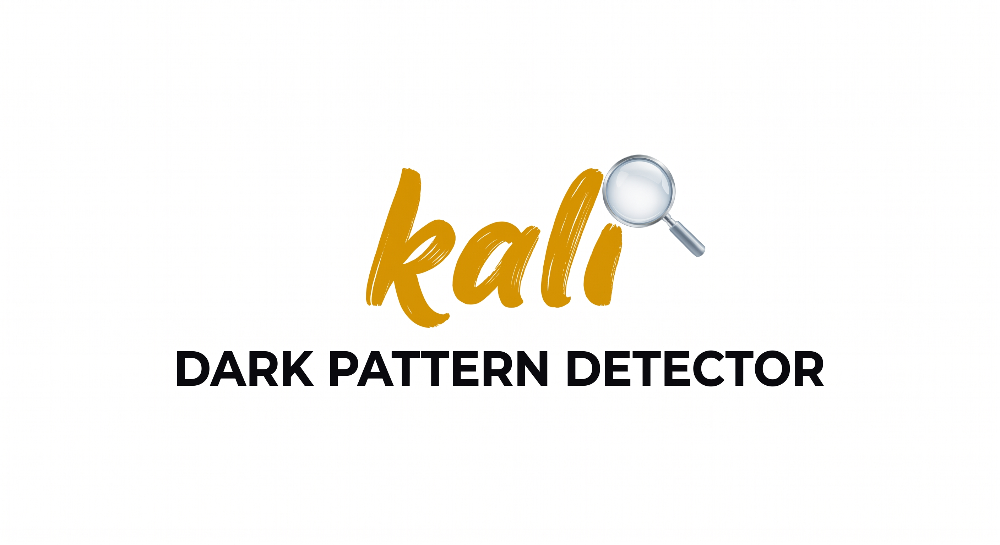

# Kali — Dark-Pattern-Monitor

Ein automatisierter Webseiten-/Design-Monitor, der digitale Oberflächen auf
manipulative Gestaltung (Dark Patterns) untersucht — als skalierbares
Marktbeobachtungs-Tool für Verbraucherzentralen und Aufsichtsbehörden, nicht
als reine Browser-Extension. Das System crawlt Zielseiten headless, erkennt
Dark Patterns über Heuristiken, visuelle Analyse und einen Claude-basierten
Textklassifikator, ordnet Funde einschlägigen Rechtsnormen zu (UWG, BGB,
DSA, DSGVO, PAngV) und sichert Screenshot/DOM/HAR gerichtsfest als Beweismittel.

Projekt für den Legal Loves Tech Hackathon 2026, Challenge der Verbraucherzentrale.
Details siehe `CLAUDE.md`.

## Setup

```bash
pip install -r requirements.txt
playwright install chromium   # mandatory — crawling fails with a confusing error without it
```

## `.env`

Copy `.env.example` to `.env` and fill in `ANTHROPIC_API_KEY`. `LEGAL_TEXT_MCP_BASE_URL`
expects a separately running `legal-text-mcp-de` server (see `app/compliance.py`
for the endpoint it calls):

```bash
uvx legal-text-mcp-de http
```

## Run

```bash
uvicorn app.main:app --reload
```

Then open http://127.0.0.1:8000/ and start a scan from the dashboard.

## PDF reports

PDF generation uses WeasyPrint, which needs GTK libraries (see the WeasyPrint
installation guide). On Windows without GTK the test suite automatically falls
back to a mock (see `tests/conftest.py`) — verify real PDF generation on
Linux/Docker before the demo.

## Tests

```bash
pytest -q
```
